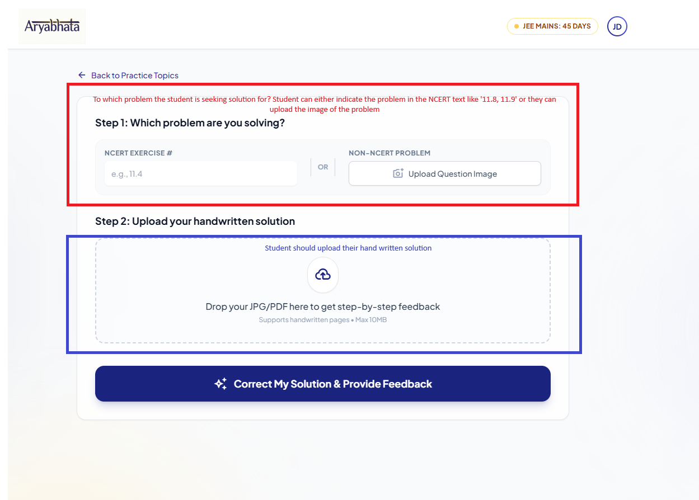

# Creating a New Azure Function workflow to Process Student's Feedback

## Introduction
The Solution Feedback's core processory is going to be this Azure Durable function which accepts the necessary parameters, process the params (& fill as needed), weaves a suite of Azure Functions and Gemini models to generate the feedback. This Feedback is then passed back to the user through Postgresql database and Azure Storage.

## Component level Flow
1. The user triggers in the UX as given in this image . Note that this is just a start. We will have other input options going forward.
2. Node.js (or any client for that matter) inserts the data into the postgresql table and pushes the message to the queue
3. Azure Durable Function StudentEvaluation Function is Triggered
    - Invoke Azure Function SplitStudentHandwriting Function to split them into individual problem solution (will return multiple image or save in Azure Storage) - can we better use cache here for speed/performance?
    - If the question input is text
        - Parse the text using Gemini-3-Flash to extract the problem numbers and exercise numbers
        - Invoke Gemini 3 Pro model with (the PDF of the chapter, problem & exercise number, student solution image) as tuples in batches. Here i expect the Gemini 3 Pro model to look into the pdf and pick the right problem and evaluate the student solution. It can use the PDF also as grounding for solution
    - If the question input is image
        - Invoke Azure Function SplitTextProblems Function to split them into individual problem images
        - Invoke Gemini 3 Pro model with (the PDF of the chapter, problem image, student solution image) as tuples in batches. Here the model is provided the problem image and the student solutio image. the PDF acts as grounding for solution.
4. Update status and data into db & Azure storage and return

### Doubt on Azure Functions SplitStudentHandwriting and SplitTextProblems
Do they need to be separate Azure Functions? Why can't they be inside StudentEvaluation to be invoked inline? This way we can avoid storing in Azure storage and retrieving, across Azure function calls and adding to latency or a need have an external cache.
There's a merit in having SplitStudentHandwriting and SplitTextProblems as invokable Azure Functions - we can use them as modules and use them in other functionality we develop in future - say we want a Question Paper evaluation feature. These can fold under them.
But communicating through Azure storage the data and function-function latency is to be avoided.

### Detailed Logic
- Process the Student input
  - Call Azure Function SplitStudentHandwriting Function to split them into individual problem solution. Will return multiple images corresponding to each problem, along with the problem no as given by the student. This can be returned or saved in Azure Storage
    (see [Student Handwriting Split Prompt](../../../../apps/backend/experiment/Student_HW_Split.md))
- Fetch the record from Postgresql db
  - This can have two paths depending on either 'problem_text_ref' or 'problem_image_url' is provided as input (from the table). In future we will have cases where both are provided, each augmenting the other.
- Solution Step
  - If 'problem_text_ref' is provided - In this model the student has entered a text input to point to the problem.
    - Call Gemini Flash lite (gemini-2.5-flash-lite) model with the prompt (see [Text Parsing Prompt](../../../../apps/backend/experiment/Text_ParsingPrompt.md)) passing the input text problem_text_ref. This will return
    the [Getting Chapter PDF](#getting-chapter-pdf) section
    - Match the problem (nos) with the chapter pdf and the cropped student problems. This should result in a list of tuples - (problem_number, student_answer_image (url), subject, chapter pdf, chapter title/id/number, Exercise details).
      - Note - we need to attach the pdf to the model
      - Invoke Gemini model in Batches of 3 (let's make this as a parameter). Prompt <<TBD>>
        - Prepare the params for the Gemini model (should we do this before or inside loop?)
  - If 'problem_image_url' is provided - Student has uploaded an image to point to the problem.
    - Call Azure Function SplitTextBookProblems Function to split them into individual problem images
      - Call Gemini model <<TBD>>
    - Match the individual problem images with the chapter pdf and the cropped student problems. This should result in a list of tuples - (problem_image_snippet (url), student_answer_image (url), subject, chapter pdf, chapter title)
      - Note in this case, we don't have the chapter pdf url right away. In the first iteration, we could have this without the pdf. We can add it subsequently.
    - Invoke Gemini model in Batches of 3 (let's make this as a parameter). Prompt <<TBD>>
      - Prepare the params for the Gemini model (should we do this before or inside loop?)
- Verify the results from Gemini
- Update the postgresql db with the results and status
- Delete the record from the feedback-jobs queue
  - Can the above two steps (updating the db and deleting the record) be executed atomic?

### Getting Chapter PDF
- This returns the specific chapter pdf url.
- Inputs:
  - Class - Mandatory
  - Board - Mandatory
  - Subject - Mandatory
  - Chapter id
  - Chapter Number
  - Chapter Title
    - One or more of the 3 fields Chapter id, Chapter Number & Chapter Title should be provided
  
  #### Logic
  - If Chapter id or chapter number is provided, it is a direct select from chapterdata table (with class, board and subject)
  - if chapter title is provided, then an embedding closeness query (in postgresql) should be done (with class, board and subject)

### Trigger
The Azure Durable function is going to be triggered by a Azure Storage Queue. The queue will be created in the same resource group as the Azure function. The Queue's name is feedback-jobs and URL is  <https://stevaluationstorage.queue.core.windows.net/feedback-jobs>

### Function Parameters
The Azure Durable function will be triggered when a new item is added to the feedback-jobs queue.
The function accepts the following parameter:
id (the function will fetch the record from the postgresql db using this id, and all details are available in the db)

### DB Details
- Get the data for the id from solution_evaluations table in  postgresql db. Here are the schema details

    | Column Name | Data Type | Nullable | Default |
    | :--- | :--- | :--- | :--- |
    | id | uuid | NO | gen_random_uuid() |
    | userid | integer | NO | NULL |
    | class | character varying | YES | NULL |
    | board | character varying | YES | NULL |
    | subject | character varying | NO | N ULL |
    | chapter_id | integer | YES | NULL |
    | chapter_title | character varying | NO | NULL |
    | chapter_number | integer | NO | NULL |
    | pdffileurl | character varying | YES | NULL |
    | status | USER-DEFINED | NO | 'PENDING'::solution_evaluation_status |
    | problem_text_ref | character varying | YES | NULL |
    | problem_image_url | text | YES | NULL |
    | student_work_url | text | NO | NULL |
    | feedback_json | jsonb | YES | NULL |
    | created_at | timestamp with time zone | NO | CURRENT_TIMESTAMP |
    | updated_at | timestamp with time zone | NO | CURRENT_TIMESTAMP |

### Checks
- subject has to be one of the entries in the table 'ClassSubjectData'
- chapter has to be one of the entries in the table 'ChapterData'

## How to access Gemini models
Azure Key Vault with BALAGAPIKEY secret
