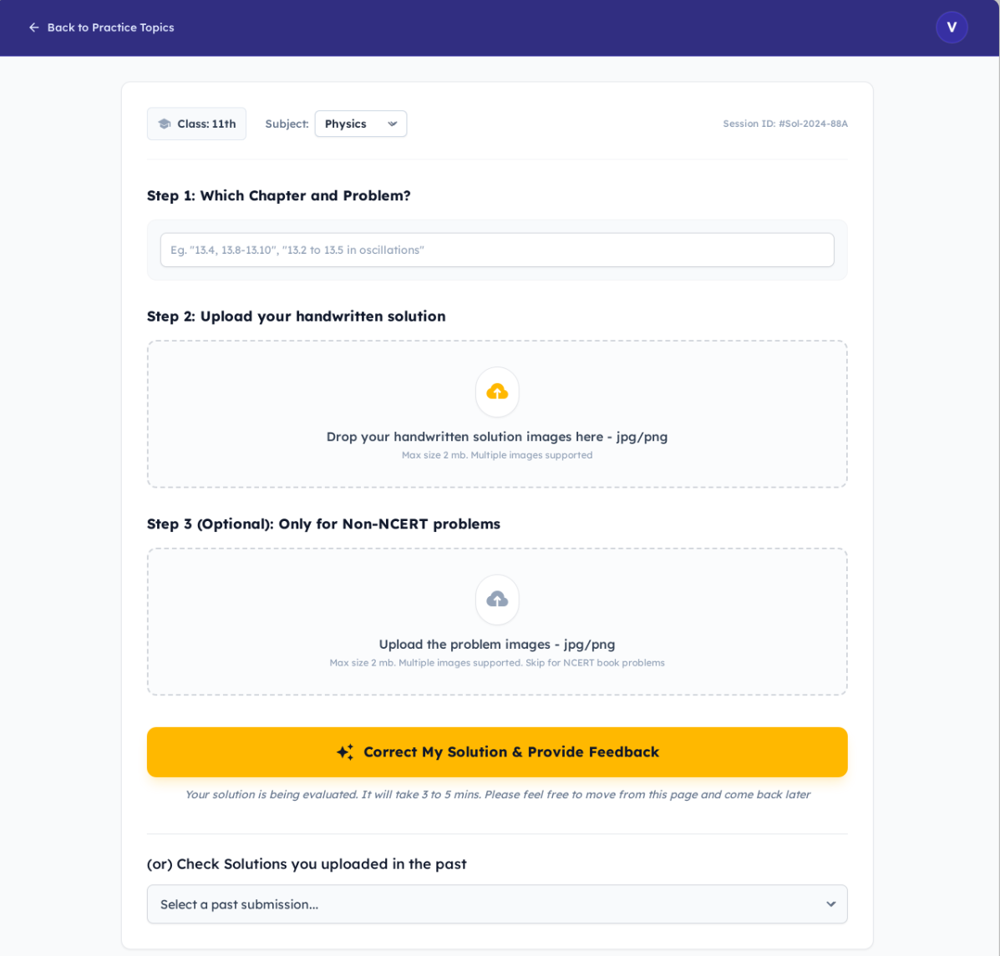

# Solution Feedback UX & Server Implementation

**Last updated**: 2026-02-21  
**Status**: Approved — ready for implementation

## UX Changes

The UX needs to be restructured. Please refer to the attached mock and review the fields carefully.
The primary functionality will be Submission for feedback and subsequent view of the same. Besides that we introduce a new functionality to view previously submitted solutions for feedback.

The page is divided into three zones:
1. **Action Area** — submission form (class/subject, problem description, image uploads, submit button)
2. **Previous Solutions Dropdown** — select a previously completed evaluation to review
3. **Solution Viewing Space** — displays the selected or just-completed evaluation results

The layout must be **mobile-responsive** (mobile-first Tailwind, stacked on small screens, side-by-side where appropriate on `md:`+).

### UX Elements

#### Submission of Solution for Feedback
1. **Class and Subject Selection**
    - Class and Subject carried from practice dashboard
    - Class cannot be changed
    - Student can select another subject (defaults to dashboard subject)

2. **Problem Description Input**
    - Full-length prominence for user text input
    - User indicates problem and chapter
    - Subject-specific default examples (disappear on user input):
      - Physics: `13.4, 13.8-13.10`, `13.2 to 13.5 in thermal props of matter`
      - Chemistry: `Organic Chemistry 10.1 and 10.5`
      - Maths: `8 to 13 miscellaneous exercise in 3d geometry`

3. **Solution Image Upload**
    - Support for multiple solution images
    - **Max 5 images** per upload zone
    - **Accepted formats**: JPG, PNG, PDF
    - **Max file size**: 10 MB per file
    - Drag-and-drop or click to select
    - Show thumbnail previews with remove button
    - **Upload mechanism**: Images are sent as `multipart/form-data` to the server; the server uploads them to Azure Blob Storage (`kalidasa/feedback/student-uploads/{userId}/{jobId}/`) and stores the blob URLs in the DB

4. **Problem Images (Optional)**
    - Only required for non-NCERT problems
    - Step 1 text sufficient for NCERT problems
    - Same upload constraints as solution images (max 5, JPG/PNG/PDF, 10 MB each)

5. **Submission Feedback**
    - Message on submit: "Your solution is submitted for evaluation. It will take 3 to 5 mins. Feel free to navigate away and come back later"
    - Display this prominently (consider more succinct version)
    - Disable further submissions

6. **Solution Status Polling**
    - Check solution status on submission
    - Background timer polls solution status by job ID (using `GET /api/evaluations/{id}`)
    - Poll interval: every 10 seconds
    - The states can be `PROCESSING`, `PENDING`, `COMPLETED`, `FAILED`
    - When the solution is ready or failed, we show the result. Where? Explained further
    - The user might have taken another action after submission (like viewing another solution - new feature). Depending on the user status, we determine where to show. Explained below in the states.
    - Once the status returns with 'COMPLETED' or 'FAILED', reenable further submissions

7. **Solution viewing space**
    - Below the action area. Here's where the solution can be viewed. Either the just submitted solution's results or the one user selects from the previous solutions are displayed in this area.
    - At a time only one solution can be viewed. If another solution is being viewed and the submitted results come (through polling), the user is notified through popup.
    - This space will be populated once the solution becomes available or display the error
    - The solution is complete if the status is 'COMPLETED'. The solution failed if the status is 'FAILED'.
        - In this case add this solution to the new Solutions dropdown being added (explained below)
    - If the status is `PROCESSING`/`PENDING`, continue to wait.

#### Previous Solutions Dropdown
This is a new feature that should be added to the Solution Feedback module, where the student can pick one of the previously submitted solutions to view them.
The previously submitted solutions are shown in a dropdown
- **Display `COMPLETED` solutions only** — FAILED solutions are excluded from the dropdown
- Show student's text input + subject
- Use same `solution viewing space` when a listed solution is selected
- The dropdown should be sorted by descending order of the submission time

#### Different UX States
1. **Initial Load** (also applies when user navigates away and returns):
    - Fetch all `COMPLETED` solutions and load them in the dropdown
    - Fetch the last submitted solution (any status — not just COMPLETED/FAILED). This is based on the most recent `created_at`.
    - If last submitted solution status is `PROCESSING`/`PENDING`: Continue to show processing message, disable new submissions.
        - Resume polling (using `GET /api/evaluations/{id}`)
        - Continue to have the Submissions disabled
    - If last submitted solution status is `COMPLETED`: Display solution in the `solution viewing space` (this will also be in the dropdown on top)
    - If last submitted solution status is `FAILED`: Show error details, reenable submissions
2. **When the user is going through a solution**
    - The polling process continues
    - If a submission has happened and the results come through polling notify the user through a popup
        - If 'COMPLETED' - "The solution is ready. You can pick from previous solutions dropdown to view the same"
        - If 'FAILED' - show the error
        - In either case, reenable submissions
3. **User is in a wait mode and the solution space is blank**
    - The polling process continues
    - If a submission has happened and the results come through polling, display the results in the `solution viewing space`
        - If 'COMPLETED' - Show solution
        - If 'FAILED' - Show the error
        - In either case, reenable submissions

## Server Requirements

Implemented as **Azure Functions** (in `apps/functions/`).

### 1. Submit Solution Job — `POST /api/evaluations`
- Accept `multipart/form-data` with image files + JSON fields
- **Parameters**: `userId`, `class`, `board`, `subject`, `problemTextRef` (required), solution image files (required), problem image files (optional)
- Upload images to Azure Blob Storage (`kalidasa/feedback/student-uploads/{userId}/{jobId}/`)
- Insert into `solution_evaluations` table with status `PENDING` and blob URLs
- Push `jobId` to `feedback-jobs` queue on `stevaluationstorage`
- Return `{ jobId }` with HTTP 202

### 2. Get Completed Jobs — `GET /api/evaluations/completed?userId={userId}`
- Fetch all `COMPLETED` jobs for the given user from `solution_evaluations`
- Return `{ evaluations: [{ id, subject, problemTextRef, createdAt }] }` (lightweight — no `feedback_json`)

### 3. Get Last Job Status — `GET /api/evaluations/last?userId={userId}`
- Retrieve the most recently created job (any status) from `solution_evaluations`
- Return `{ id, status, subject, problemTextRef, feedbackJson, createdAt }`

### 4. Get Job by ID — `GET /api/evaluations/{id}`
- Retrieve a specific evaluation by its UUID
- Return `{ id, status, subject, problemTextRef, feedbackJson, createdAt }`
- Used for polling and for loading a selected previous solution
