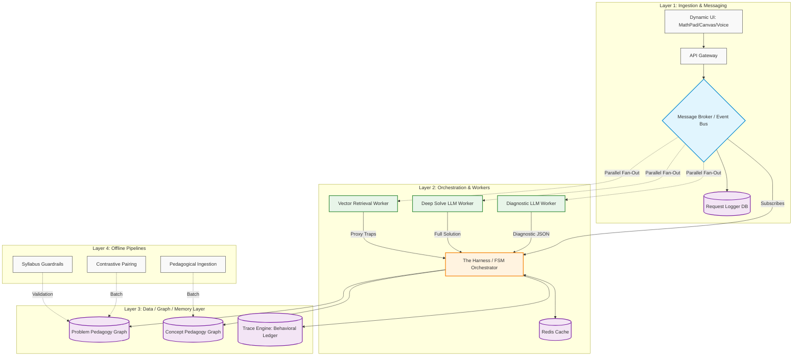
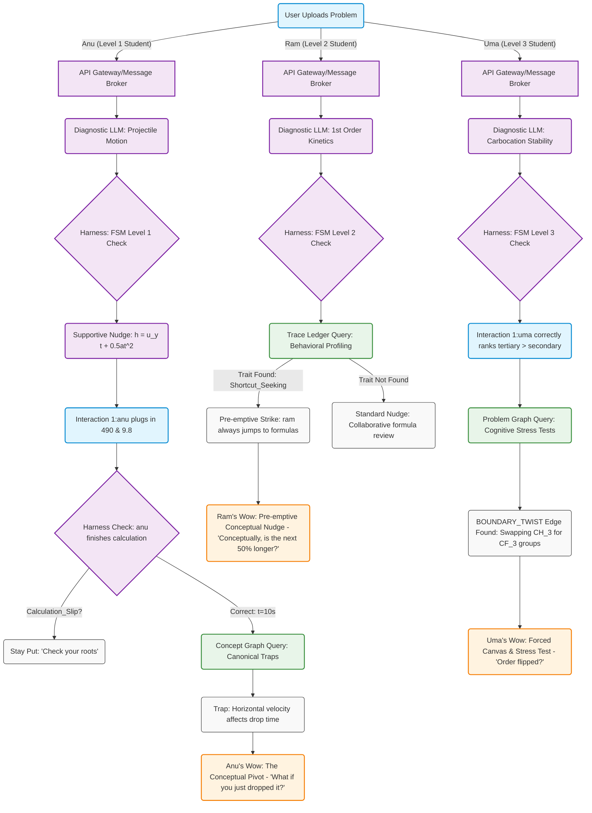

***

# 📘 Aryabhata: Master Architecture & Product Blueprint (v7.0)

## 1. Core Thesis & Product Identity
* **The Vision:** An AI that rewires how students think. It operates on a sliding scale: beginning as a highly capable, ridiculously fast "Solution Engine" to earn a nascent user's trust, and graduating into a **Pedagogical Engine** that enforces exam instincts and conceptual mastery.
* **The Persona ("Guru"):** A culturally rooted, expert CBSE/JEE teacher. Calm, observant, and strict. Uses Socratic nudging, Behavioral Profiling, and "Cognitive Stress Testing" to cure "metacognitive laziness."

---

## 2. The Engine: Deterministic Routing & The Two-Pass Solver
* **The Diagnostic Pass (Fast LLM - <800ms):** Outputs a strict JSON. Verifies the problem is readable, classifies the student's error, extracts variables, and generates an initial "Safe Nudge".
* **The Deep Solve (Heavy LLM):** Executes the full mathematical reasoning asynchronously while the user answers the Diagnostic Nudge.
* **The FSM Harness:** Traditional deterministic code that intercepts the LLM output and routes the student using Hardcoded Error Debugging (e.g., dropping difficulty for `Cognitive_Overload`, or traversing the Concept Graph for a `Tool_Failure`).

---

## 3. The Brain: The "Two-Graph" Architecture
* **Graph A: The Concept Pedagogy Graph (The Diagnostic Map):** A finite, static graph of the ~2,500 core CBSE/JEE concepts. Defines prerequisites, canonical traps, and isomorphic (cross-subject) mathematical links.
* **Graph B: The Problem Pedagogy Graph (The Vehicle):** A growing graph of 50,000+ JEE questions representing actionable test cases. Edges Define the Teaching Path: `NUMERICAL_TWIN`, `BOUNDARY_TWIST`, and `CATCHES_MISTAKE`.

---

## 4. The Memory: Trace Engine & Behavioral Profiling
The system does not just remember *what* a student gets wrong; it remembers *how* they act. 
* **The Behavioral Trait Ledger:** Logs cross-domain metacognitive habits (e.g., `Shortcut_Seeking`, `Calculation_Carelessness`, `Skips_Diagrams`). 
* **Engineering Impact:** Allows the FSM to deploy "Pre-emptive Strikes" across subjects. If a student skips Free Body Diagrams in Physics, the system preemptively intercepts them when they try to rush a Chemistry kinetics formula.

---

## 5. The Frontend: Dynamic Pedagogical Workspace
To prevent students from gaming the AI like a standard chatbot, the UI dynamically restricts input modalities based on the FSM Strictness Level.

* **Modal 1: Context-Aware Math Pad (Levels 1 & 2):** A dynamically generated keyboard that only shows the variables necessary for the current topic, hiding complex calculus/integral symbols to reduce cognitive friction.
* **Modal 2: The Digital Whiteboard / Forced Canvas (Level 3):** The standard text box locks. The student *must* draw the Free Body Diagram or Organic Chemical structure. The frontend locally converts the drawing to a lightweight LaTeX or SMILES string before sending it to the API to save backend compute.
* **Modal 3: The Voice Bailout:** A prominent microphone button allowing students to verbally explain a concept when they are stuck. Transcribed audio is converted to intent and fed directly to the FSM to unblock them.

---

## 6. The Execution Pipeline (Pub/Sub)
* **T = 0.0s (Ingestion):** API Gateway pushes a `NewRequest` event to the **Message Broker**.
* **T = 0.1s (Fan-Out):** Parallel triggers Vector Embedding, Fast Diagnostic Pass, and Heavy Deep Solve Pass. The Harness subscribes and checks the Redis Cache.
* **T = 0.8s (Triage Gate):** Diagnostic JSON returns. If invalid, the Harness aborts the expensive Deep Solve.
* **T = 1.0s (The Wow / Engagement):** The Harness pushes the initial engaging nudge to the UI.
* **T = 1.5s to 4.5s (Covert Processing):** The Deep Solve finishes and caches.
* **T = 6.0s (Guru Activation):** The FSM intercepts the user's math, pulls the validated solution from cache, categorizes errors, and routes the student.

---

## 7. The Core "Wow" Use Cases
* **Level 1 (Anu - The Conceptual Pivot):** After guiding the user through a simple projectile math problem, the FSM triggers a low-stakes conceptual pivot: *"You got 10 seconds. Now, if you just dropped it straight down instead of throwing it horizontally, does it take more or less time?"*
* **Level 2 (Ram - The Pre-emptive Strike):** Ram uploads a Chemistry Kinetics problem. The FSM reads his Trace Ledger, sees a `Shortcut_Seeking` trait from a prior Physics session, and intercepts him: *"I know you love jumping straight to the formulas, Ram. But conceptually, if the first 50% takes 30 mins, does the next 50% take longer?"*
* **Level 3 (Uma - The Boundary Twist):** Uma correctly ranks carbocation stability. The FSM pulls a `BOUNDARY_TWIST` edge from the Problem Graph: *"Spot on. But let's test that instinct. I'm locking the keyboard. Use the canvas to show me what happens if we swap those methyl groups for CF3 groups. Does the order flip?"*

---

## 8. System Architecture Schematic (Mermaid.js)
*Copy and paste this code block into any markdown file in your GitHub repo to render the live architecture diagram.*

## 9. Aryabhata: User Journey & Interaction Flows (v1.0)

