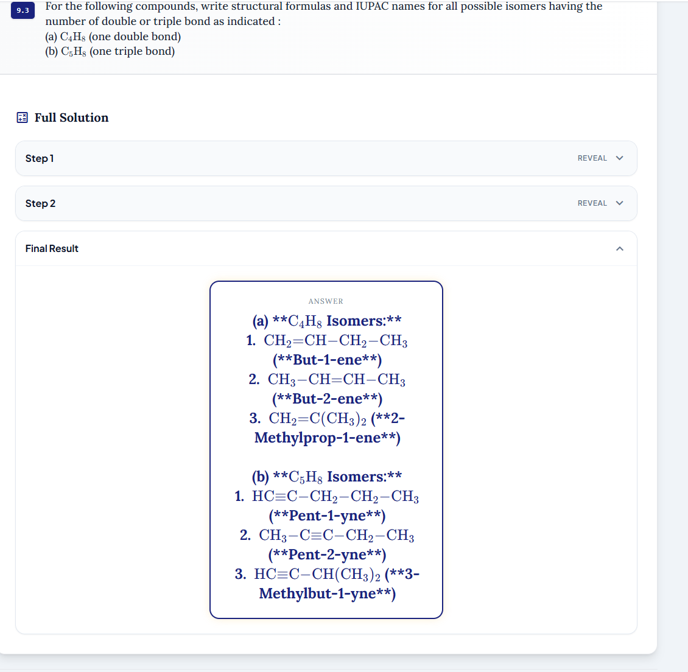
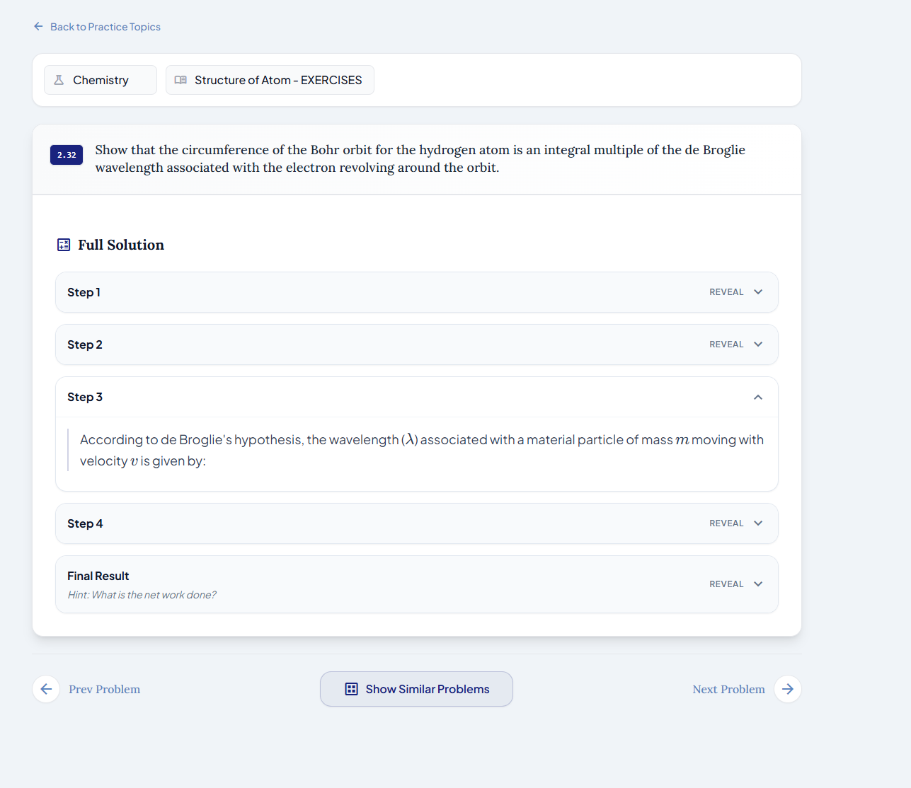

# Pending Issues
| Issue | Area | Status |
| :--- | :--- | :--- |
| Backend | Chemical equations, when they have vertical connections are not extracted properly. Eg. Hydrocarbons chapter  | Open |
| Backend | Adjacent, but not inline are not extracted properly. keph102.pdf, 2.17, 2.18, 'Motion in a straight line' | Open |
| Backend | Error or mismatch in the results esp in Organic Chemistry | Open |
| Experience | How can we improve the curiosity of the students at every step? Better yet, can we make it interactive and fun? | Open |
| Security | Review Storage and other assets of Azure for public access and security | Open |
| Experience | when a chapter has 50 problems and the student wants to check 32nd problem, then it is really cumbersome to go from 1 to 32. We can try the sliding options at the top. | Open |
| Backend | Some times the model misses some details in the solution. Should we have a mechanism to check and reprocess? In general we should have a way to reprocess. Here's an example.  | Open |
| Feature | Feedback solution data. Collect and organise | Open |
| Experience | Deploy on Azure. | Open |
| Backend | Mathematics | Open |
| Feature | Student data image splitting | Open |
| Experience | In the Practice Exercise page, always have step 1 opened. If i open other steps and navigate to next question, it opens in the later steps (probably following the prev page) | Open
| Solution | We should give a nudge that helps students to think about solution, instead of step 1 | Open

