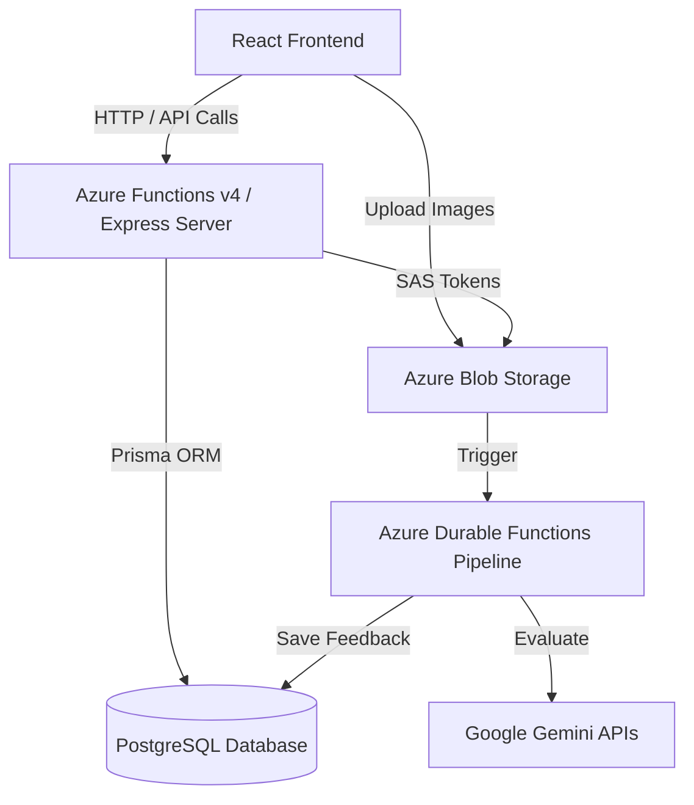

# AryaBhatta End-to-End Architecture & Design

## Overview
AryaBhatta is an educational web application designed to facilitate student practice, learning resumption, and automated AI-driven solution evaluation. The system operates on a modern cloud-native stack transitioning towards a serverless architecture.

### Technology Stack
- **Frontend**: React (Vite, TypeScript, React Router)
- **Backend (Legacy/Migration)**: Node.js (Express)
- **Backend (Target)**: Azure Functions v4 (Serverless Node.js/TypeScript)
- **Database**: PostgreSQL (Managed via Prisma ORM)
- **Storage**: Azure Blob Storage (for question assets and user uploads)
- **AI/ML Pipelines**: Azure Durable Functions (Python-based) invoking Google Gemini models for image parsing, text extraction, and solution evaluation.

---

## 1. System Architecture Diagram (Conceptual)

---

## 2. End-to-End Functionality Mapping

### 2.1 Authentication & Session Initialization
- **Functionality**: Automatically logs the user in and establishes session context.
- **UX Route**: Handled at application root (`App.tsx` via `initSession`)
- **API Endpoint / Azure Function**: `/api/auth/login` ➔ `authLogin.ts`
- **Data/Logic**: Fetches user details using a configured default identity.
- **DB Interface**: `PrismaClient`
- **DB Schema Models**: `userprofiledata`

### 2.2 Main Dashboard (Resume Learning)
- **Functionality**: Displays the landing page where a user can resume their last attempted exercise.
- **UX Route**: `/` (`MainDashboard` component)
- **API Endpoint / Azure Function**: `/api/user/resume` ➔ `userResume.ts`
- **Data/Logic**: Queries the user's latest attempt timestamp to fetch the relevant chapter and question IDs.
- **DB Interface**: `PrismaClient`
- **DB Schema Models**: `userexercisedata` (joined with `chapterdata`)

### 2.3 Practice Dashboard
- **Functionality**: Allows the user to select their class, subject, and board to view available chapters and exercises.
- **UX Route**: `/practice` (`PracticeDashboard` component)
- **API Endpoint / Azure Function**: `/api/practice/dashboard` ➔ `practiceDashboard.ts`
- **Data/Logic**: Resolves supported boards, classes, and subjects, then retrieves the corresponding syllabus/chapters. Defaults to the user's profile settings.
- **DB Interface**: `PrismaClient`
- **DB Schema Models**: `classsubjectdata`, `chapterdata`, `userprofiledata`

### 2.4 Practice Session (Answering Questions)
- **Functionality**: Presents the student with questions, handles cross-exercise navigation, and renders images securely. Tracks student progress.
- **UX Route**: `/practice/:chapterId` (`PracticeSession` component)
- **API Endpoint / Azure Function (Fetch)**: `/api/practice/question` ➔ `practiceQuestion.ts`
- **API Endpoint / Azure Function (Save)**: `/api/practice/progress` ➔ `practiceProgress.ts`
- **Data/Logic**: 
  - Resolves target question (resume mode or start). 
  - Dynamically injects short-lived **Azure Blob Storage SAS Tokens** into the question's figure URLs.
  - Determines `next` and `prev` cross-exercise navigation links.
  - Records user attempt history.
- **DB Interface**: `PrismaClient` & Azure Storage SDK
- **DB Schema Models**: `questiondata`, `exercisedata`, `chapterdata`, `userexercisedata`

### 2.5 Solution Feedback & Evaluation
- **Functionality**: Provides AI-driven feedback on uploaded handwritten student solutions, highlighting pinpointed errors, and summarizing performance.
- **UX Route**: `/feedback` (`SolutionFeedback` component)
- **API Endpoint / Azure Function**: 
  - `submitEvaluation.ts`
  - `getCompletedEvaluations.ts`
  - `getEvaluationById.ts`
  - `getLastEvaluation.ts`
- **Data/Logic (Durable Function Pipeline)**: 
  - User submits a solution to Blob Storage.
  - **Azure Durable Function** orchestrates: `read_evaluation` ➔ `split_student_hw` ➔ `parse_text_ref` ➔ `match_solutions` ➔ `evaluate_batch`.
  - Gemini APIs analyze the cropped images against reference textbook data and return structured JSON feedback.
  - Generates LaTeX formatted output and detailed pinpoint error analysis.
- **DB Interface**: Pipeline writes to `solution_evaluations` (with micro-state checkpointing via `pipeline_steps` JSONB column). Frontend queries via Prisma.
- **DB Schema Models**: `solution_evaluations` (from the DB Master sql schema modifications)

### 2.6 Analytics & Challenges
- **Functionality**: Performance tracking and gamified challenges.
- **UX Route**: `/analytics` (`PerformanceCompass` component), `/challenge` (`ChallengeDashboard` component)
- **State**: Under active development/refinement.

---

## 3. Database Schema Overview (Prisma Model)

The central source of truth mapping the educational content structure to user activity.

- **`classsubjectdata`**: Defines the taxonomy of supported classes, subjects, and educational boards.
- **`chapterdata`**: The high-level syllabus nodes containing PDFs and metadata.
- **`exercisedata`**: Sub-sections within chapters.
- **`questiondata`**: The lowest granularity containing the actual question content (JSON blob with figures/text) and reference solutions.
- **`userprofiledata`**: Core student information (Class, Board, Goal).
- **`userexercisedata`**: The activity ledger tracking every question a student attempts.

## 4. Migration & Evolution Strategy
The backend is actively migrating from an Express.js monolith (`apps/server`) to Azure Functions v4 (`apps/functions`) to improve scalability, reduce cold-start latency, and enforce discrete bounded contexts. 

Simultaneously, the evaluation logic leverages the `StudentEvaluationFunction` pipeline in Python, utilizing Durable Functions for resilient, checkpointed orchestration of complex LLM (Gemini) interactions.